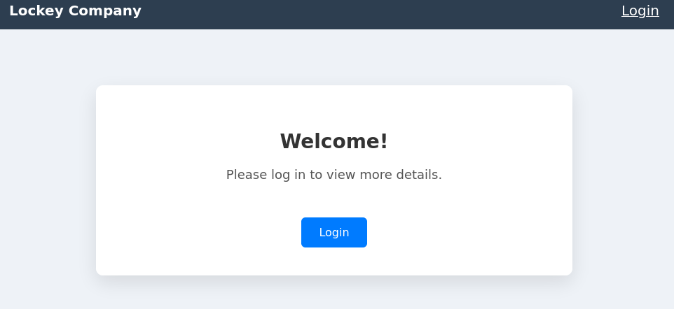
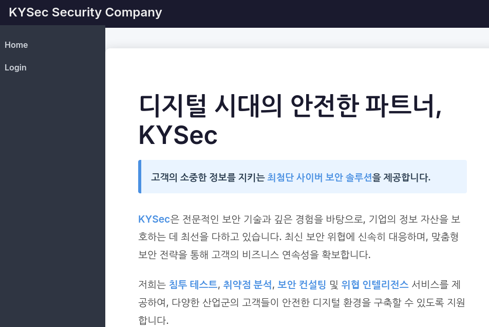
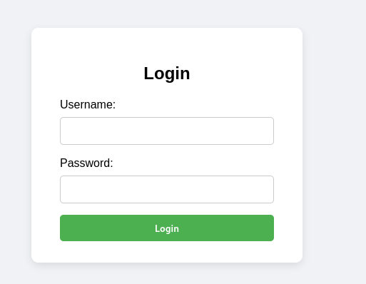
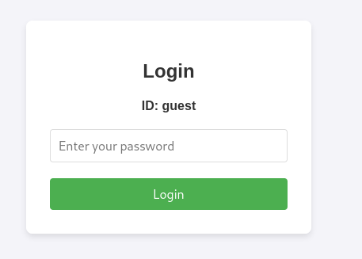
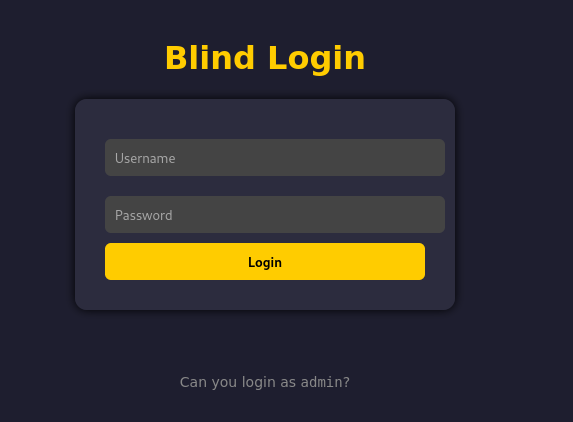
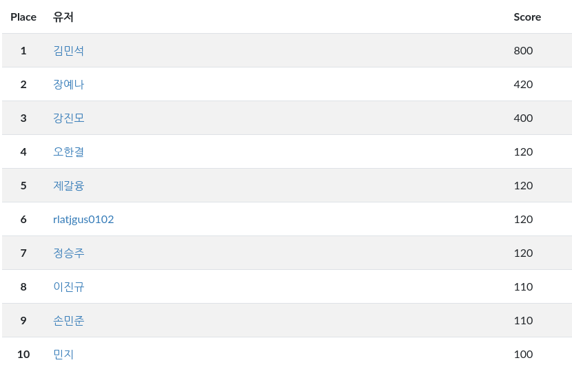

# SW동아리 결과보고서 (Lockey)

**1학년 학생들이 6개월 동안 배운 내용을 바탕으로 문제를 만들어 CTF 대회를 열었습니다.**

1. Cookie
- 웹 보안의 기초 개념인 쿠키를 분석하여 저장된 FLAG 값을 획득하는 문제

2. Session
- 웹 보안에서 서버 측에서 관리하는 세션을 분석하여 FLAG 값을 획득하는 문제

3. SQL (1)
- 대표적인 웹 취약점인 SQL 인젝션을 통해 FLAG 값을 획득하는 문제 (1)

4. SQL (2)
- 대표적인 웹 취약점인 SQL 인젝션을 통해 FLAG 값을 획득하는 문제 (2)

5. Blind SQL
- Blind SQL 인젝션을 통해 FLAG 값을 획득하는 문제

**최종 결과**

  
  

